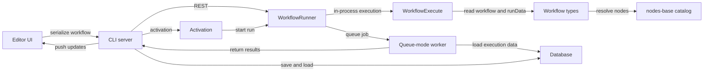

# The Big Picture

`n8n` is a canvas first, but the runtime lives in a small set of layers that each own a different part of the job. The editor shapes workflow data, the CLI layer decides where execution runs, the engine walks the graph, and the shared workflow package gives every layer the same language for nodes, connections, and run data.

## Platform map

The workspace layout in this monorepo points to the same dependency direction at every layer. `packages/workflow` defines the core workflow vocabulary through `IWorkflowBase`, `INode`, `INodeType`, and the execution data types; `packages/core` turns that model into live runs; `packages/cli` hosts the main server, queue workers, and webhook processors; and `packages/frontend/editor-ui` renders and edits the canvas, then hands serialized workflow state back to the server.

The structural packages sit beside those layers rather than inside the workflow engine. `@n8n/config` carries shared runtime settings, `@n8n/db` owns persistence, `@n8n/di` wires services together, `@n8n/task-runner` isolates work that should not share the main process, and `@n8n/tournament` backs template expression handling. `packages/nodes-base` matters as the integration catalog, not as the executor.

## Workflow as data

A workflow begins as data: a list of nodes, a connection map keyed by output type, plus saved settings, static data, and pin data. `IWorkflowBase` defines that artifact, the database stores it, and the editor canvas renders the same shape so the user sees the saved graph rather than a separate draft model.

When the runtime needs graph reasoning, `Workflow` turns that raw artifact into a navigable object. The class builds both `connectionsBySourceNode` and `connectionsByDestinationNode`, which lets the engine move in either direction without rebuilding indexes during every hop.

## Node capability model

An `INodeType` describes a node as a capability-bearing class, not as a box on the canvas. The runtime may call `execute`, `poll`, `trigger`, `webhook`, or `supplyData`, and declarative nodes use request routing while programmatic nodes implement `execute()` directly. The deeper behavior of triggers and webhooks belongs on [Triggers, webhooks, and activation](./07-triggers-webhooks-and-activation.md).

## Execution path

### From the editor to the server

`useRunWorkflow.ts` serializes the current workflow state, gathers the selected start and destination nodes, and sends the run request to the server. The editor keeps its own execution state in step with that request so the canvas can show a pending run immediately.

### From the server to the right process

`WorkflowRunner` decides whether the run stays in the main process or moves into queue mode. In queue mode it writes job data to Bull, and `ScalingService` hands that work to queue workers or to the dedicated webhook processor path.

### From graph walk to result

`WorkflowExecute` loads the workflow into execution state, chooses the start node, walks the graph, and fills `runData` as each node finishes. Depending on the mode, the runtime stores execution data in the database and later rehydrates the full result before it returns to the editor or to the waiting response promise.

The sibling pages below cover the details behind that path: [Anatomy of an execution](./01-anatomy-of-an-execution.md), [How the engine decides what runs next](./02-how-the-engine-decides-what-runs-next.md), and [One execution, many processes](./08-one-execution-many-processes.md).

### Platform map diagram

## Process model

The root `package.json` exposes `n8n start`, `n8n worker`, and `n8n webhook`, which together form the main process, the queue worker, and the dedicated webhook processor. `n8n start` boots the main server, while queue mode adds the worker and webhook paths that the queue-backed execution model needs. For deployment guidance, see the official queue mode hosting guide: [Enable queue mode](https://docs.n8n.io/deploy/host-n8n/configure-n8n/scaling/enable-queue-mode).

## What this guide is not

> **Note**
> This guide is not a node catalog, not a deep dive into the fast-moving AI areas, and not a full description of the separate `@n8n/engine` scaffold. As of this snapshot, `@n8n/engine` reads as a scaffold rather than the live runtime, so this page stays focused on the engine that actually runs.

For broader context, see [How n8n works](https://docs.n8n.io/deploy/host-n8n/understand-the-architecture/how-n8n-works), [Choose a node building style](https://docs.n8n.io/connect/create-nodes/plan-your-node/choose-a-node-building-style), and [Understand n8n's data structure](https://docs.n8n.io/build/work-with-data/understand-n8ns-data-structure).

## Where to look in the code

- `packages/workflow/src/interfaces.ts` — defines `IWorkflowBase`, connection types, execution data, and node capability interfaces.
- `packages/workflow/src/workflow.ts` — builds forward and reverse connection indexes and provides graph traversal helpers.
- `packages/core/src/execution-engine/workflow-execute.ts` — walks the workflow, fills `runData`, and handles partial execution.
- `packages/core/src/execution-engine/routing-node.ts` — runs declarative nodes by turning request descriptors into HTTP calls.
- `packages/cli/src/workflow-runner.ts` — chooses local or queue execution and returns results to the caller.
- `packages/cli/src/commands/start.ts`, `worker.ts`, and `webhook.ts` — start the main process and the queue mode companions.