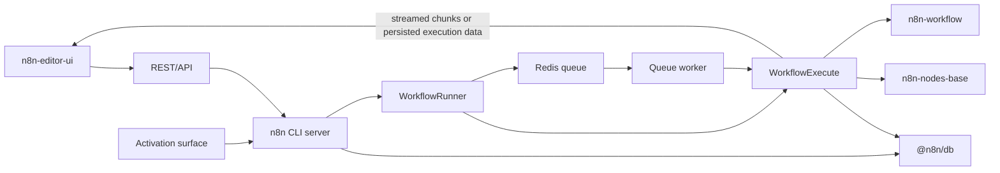

# The Big Picture

This page maps the whole n8n platform at the architectural level. It answers what runs where, which packages matter, and where to open next when the runtime model needs more depth. For the official architecture overview, see [how n8n works](https://docs.n8n.io/deploy/host-n8n/understand-the-architecture/how-n8n-works).

## Monorepo shape

The root `package.json` and `pnpm-workspace.yaml` define a pnpm and Turbo workspace that spans `packages/*`, `packages/@n8n/*`, `packages/frontend/**`, `packages/extensions/**`, and `packages/testing/**`. That shape keeps the platform split by responsibility: `n8n-workflow` carries the shared workflow data and type layer, `n8n-core` carries the live execution engine, `n8n` in `packages/cli` carries the server and orchestration layer, `n8n-editor-ui` carries the Vue canvas editor, and `n8n-nodes-base` carries the integration node catalog.

The support packages sit beside those layers and supply the platform plumbing they need. `@n8n/db` handles persistence and migrations, `@n8n/config` carries configuration, `@n8n/di` carries dependency injection, `@n8n/task-runner` supports separate task processes, `@n8n/tournament` supports expression runtime helpers, and `@n8n/expression-runtime` provides isolated expression evaluation. The dependency direction follows that split: the server and execution layers depend on the shared workflow model and support packages, not the other way around.

## The workflow artifact

n8n stores a workflow as data. `IWorkflowBase` and the related connection types in `packages/workflow/src/interfaces.ts` define that persisted shape: nodes, connections, settings, static data, pin data, and execution related metadata. The `Workflow` class in `packages/workflow/src/workflow.ts` turns that plain object into a runtime graph by indexing nodes by name and building both forward and reverse connection maps, which gives the engine a fast way to ask what points into a node and what follows from it.

That shared model lets the same workflow move through the database, the canvas editor, and the execution engine without changing its meaning. The database layer stores the workflow record, the editor reshapes the same structure for the canvas, and the runtime loads the same structure into graph indexes before execution starts.

## The node model

Nodes act as capability-bearing classes. `INodeType` exposes optional entry points such as `execute`, `poll`, `trigger`, `webhook`, and `supplyData`; programmatic nodes use `execute()`, while declarative nodes define `description.requestDefaults` and let `RoutingNode` in `packages/core/src/execution-engine/routing-node.ts` assemble the request and response flow from their parameters. That split keeps most integration nodes declarative and reserves custom code for nodes that need direct control. For the full capability model, see [/07-triggers-webhooks-and-activation.md](./07-triggers-webhooks-and-activation.md) and the official [node building style guide](https://docs.n8n.io/connect/create-nodes/plan-your-node/choose-a-node-building-style).

## How execution moves

When the canvas saves a workflow or a trigger fires, the request enters the `n8n` server. `WorkflowRunner` in `packages/cli/src/workflow-runner.ts` sits at the boundary between stored workflow data and execution control: it registers the run, checks credentials, prepares lifecycle hooks, and decides whether the run stays in the main process or moves into queue mode. The process entry points in `packages/cli/src/commands/start.ts` and `packages/cli/src/commands/webhook.ts` show the two shapes that receive work.

In the in-process path, `WorkflowRunner` builds a `Workflow` object and hands it to `WorkflowExecute` in `packages/core/src/execution-engine/workflow-execute.ts`. `WorkflowExecute` is the live engine: it walks the graph, schedules nodes, handles partial executions, and owns the lower-level runtime behavior that the sibling pages cover. Its declarative path runs through `RoutingNode`, while programmatic nodes call `execute()` directly. See [/01-anatomy-of-an-execution.md](./01-anatomy-of-an-execution.md), [/02-how-the-engine-decides-what-runs-next.md](./02-how-the-engine-decides-what-runs-next.md), and [/08-one-execution-many-processes.md](./08-one-execution-many-processes.md).

In queue mode, `WorkflowRunner` hands the job to `ScalingService` in `packages/cli/src/scaling/scaling.service.ts`. That service writes Bull jobs to Redis, wakes a worker, and later reconciles the stored execution with the job result. The worker path in `packages/cli/src/commands/worker.ts` finishes the same execution and sends streamed chunks or stored execution data back through the active execution and storage layers, so the editor can render progress and the final result from the same execution record.

## The process model

`n8n start` launches the main process. That process serves the UI and API and, in regular mode, runs executions itself. `n8n worker` launches a separate queue worker that consumes Bull jobs, and `n8n webhook` launches a dedicated webhook processor that only accepts production URLs. The operational depth of queue mode belongs in the official [enable queue mode](https://docs.n8n.io/deploy/host-n8n/configure-n8n/scaling/enable-queue-mode) guide; this page keeps the view at the process layout level.

## What this guide is not

This page is not a node catalog, not API reference, and not a deep dive into the AI packages still in active development in `packages/cli/package.json`. It maps the stable platform shape and stops there.

## Platform map

## Where to look in the code

- `package.json` and `pnpm-workspace.yaml` — workspace shape, root scripts, and the monorepo boundaries.
- `packages/workflow/src/interfaces.ts` and `packages/workflow/src/workflow.ts` — workflow data model and graph indexing.
- `packages/core/src/execution-engine/workflow-execute.ts` — live runtime engine and graph walking.
- `packages/core/src/execution-engine/routing-node.ts` — declarative node request handling.
- `packages/cli/src/workflow-runner.ts` and `packages/cli/src/scaling/scaling.service.ts` — execution boundary and queue mode dispatch.
- `packages/cli/src/commands/start.ts`, `packages/cli/src/commands/worker.ts`, and `packages/cli/src/commands/webhook.ts` — process entry points.