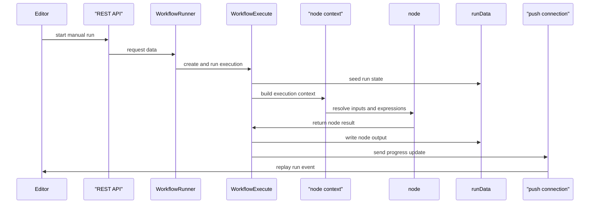

# Anatomy of an execution

A manual run starts as a canvas action, but the live execution quickly becomes one serialized run object that moves through the editor, the server, and the engine. This page follows that object from the first click to the canvas update so the runtime path stays clear.

## Site map

- [The big picture](/00-the-big-picture.md)
- [How the engine decides what runs next](/02-how-the-engine-decides-what-runs-next.md)
- [The canvas is not the execution](/03-the-canvas-is-not-the-execution.md)
- [Partial executions and dirty nodes](/04-partial-executions-and-dirty-nodes.md)
- [Items, runs, and `pairedItem`](/05-items-runs-and-paireditem.md)
- [Expressions and user code](/06-expressions-and-user-code.md)
- [One execution, many processes](/08-one-execution-many-processes.md)
- [About this site](/09-about-this-site.md)

## Background reading

- [Types of executions](https://docs.n8n.io/build/understand-workflows/understand-executions/types-of-executions)
- [Understand execution order](https://docs.n8n.io/build/flow-logic/understand-execution-order)
- [Understand n8n's data structure](https://docs.n8n.io/build/work-with-data/understand-n8ns-data-structure)
- [Enable queue mode](https://docs.n8n.io/deploy/host-n8n/configure-n8n/scaling/enable-queue-mode)

## The live manual path

### The editor decides what to run

`runEntireWorkflow` in `packages/frontend/editor-ui/src/app/composables/useRunWorkflow.ts` starts the trace. It resolves the selected trigger, records telemetry, and calls `runWorkflow`. That method saves dirty workflow state when needed, gathers the canvas data, and builds `IStartRunData` through `consolidateRunDataAndStartNodes`.

A `destinationNode` changes the request into a partial execution, which belongs on [04-partial-executions-and-dirty-nodes.md]. The ordinary manual full-run path leaves `runData` empty, sends the workflow id, start nodes, and trigger input to the server, and keeps the run focused on the workflow's natural start point.

`runWorkflowApi` refuses to start unless the push connection is already open, because the editor needs the live stream before the execution begins. The request then leaves the editor through the workflows store and reaches the server.

### The server registers the execution

`WorkflowRunner` in `packages/cli/src/workflow-runner.ts` receives the request, registers the execution in `ActiveExecutions`, and sets up the lifecycle hooks that follow the run. It also establishes the execution context before persistence so the stored record does not keep raw trigger data.

`WorkflowRunner.run` decides whether the work stays in the main process or moves to queue mode. This page follows the in-process manual path, where `runMainProcess` prepares the workflow and then hands control to `ManualExecutionService.runManually`.

`ManualExecutionService` in `packages/cli/src/manual-execution.service.ts` chooses the full-run branch when the request does not carry partial run data. It builds a fresh `WorkflowExecute` instance for the ordinary manual path, and it only rewires a targeted run when a destination node points at a tool and needs `TOOL_EXECUTOR_NODE_NAME`.

### The engine turns the run into state

`WorkflowExecute` in `packages/core/src/execution-engine/workflow-execute.ts` owns the live run. Its constructor holds a single `IRunExecutionData` object, and `createRunExecutionData` in `packages/workflow/src/run-execution-data-factory.ts` fills that object with `startData`, `resultData`, `executionData`, `waitingExecution`, `waitingExecutionSource`, `resumeToken`, and the other defaults that keep the run serializable.

`WorkflowExecute.run` seeds `executionData.nodeExecutionStack` with the first node and records the initial `resultData.pinData`. That stack and result object stay together for the whole execution; the engine does not hand work off to a separate canvas model.

### The loop drives one node after another

`processRunExecutionData` starts by setting up the execution, establishing the workflow expression isolate, and checking the workflow for issues. It then loops until `nodeExecutionStack` runs dry, shifting the next `IExecuteData` entry, calculating the current run index, and stopping if the execution times out or the same node-and-run pair appears twice in a row.

The loop keeps the node order honest. `addNodeToBeExecuted` uses `push` or `unshift` according to `workflow.settings.executionOrder`, so the engine follows the workflow's ordering rule rather than guessing from the canvas layout. The helper also holds multi-input work in `waitingExecution` and `waitingExecutionSource` until every input arrives.

`runNode` creates an `ExecuteContext` from `packages/core/src/execution-engine/node-execution-context/node-execution-context.ts`. That context gives the node the workflow snapshot, the current node, the current run data, the current run index, the input data, and the additional data helpers that resolve parameters, expressions, and credentials. `NodeExecutionContext.getNodeParameter` and `evaluateExpression` resolve against the same live run object that the engine keeps in memory.

Retries stay inside the loop. If a node sets `retryOnFail`, the engine retries the node up to `maxTries`, waits between attempts, and keeps the same run object in play. If `runNode` returns an engine request, `handleEngineRequest` schedules the requested follow-up work and the loop continues with the new stack state.

### The run object keeps the results

After each node finishes, the engine writes an `ITaskData` entry into `resultData.runData[nodeName]`. That entry carries the start time, execution index, execution time, status, metadata, and dynamic credential flags, and it becomes the source of truth for everything the editor later shows.

Downstream nodes enter the stack through `addNodeToBeExecuted`, and nodes with multiple inputs wait until `waitingExecution` and `waitingExecutionSource` gather every branch. When the node produces output, `lastNodeExecuted` updates as progress moves forward. When `saveExecutionProgress` runs in `packages/cli/src/execution-lifecycle/save-execution-progress.ts`, it writes that node name back to storage and marks the execution as running.

The canvas styling follows that same result data. The green borders and item counts do not come from a separate canvas execution model; they reflect `resultData.runData` after the push layer replays it.

### The hooks push progress back to the editor

`ExecutionLifecycleHooks` in `packages/core/src/execution-engine/execution-lifecycle-hooks.ts` defines the lifecycle moments that the runtime can observe. The CLI wiring in `packages/cli/src/execution-lifecycle/execution-lifecycle-hooks.ts` attaches the push, save-progress, persistence, and status handlers to those moments.

`hookFunctionsPush` sends `executionStarted`, `nodeExecuteBefore`, `nodeExecuteAfter`, `nodeExecuteAfterData`, `executionWaiting`, and `executionFinished` messages through `Push` whenever `pushRef` exists. `packages/frontend/editor-ui/src/app/stores/pushConnection.store.ts` receives those messages, decodes them, and fans them out to the editor listeners that redraw the canvas.

### Finalization closes the run

`processSuccessExecution` decides whether the run ends in `success`, `error`, `canceled`, or `waiting`. It moves node metadata into the final run data, captures `stoppedAt`, closes any trigger or webhook cleanup function, and fires `workflowExecuteAfter` so the CLI layer can persist or prune the execution.

If `waitTill` stays set, the engine keeps the run alive and the push layer emits `executionWaiting`; that branch belongs with [08-one-execution-many-processes.md]. A `Wait` node can hold the execution open across processes, but the same run object still carries the state.

`packages/cli/src/execution-lifecycle/execution-lifecycle-hooks.ts` and `packages/cli/src/executions/execution-persistence.ts` decide what storage keeps. Save settings can keep the execution, soft-delete a manual run, or prune an unsaved run according to the configured retention rules.

## One execution at a glance

1. `packages/frontend/editor-ui/src/app/composables/useRunWorkflow.ts :: runEntireWorkflow` resolves the trigger and starts the manual run.
2. `packages/frontend/editor-ui/src/app/composables/useRunWorkflow.ts :: runWorkflow` saves dirty state and builds `IStartRunData`.
3. `packages/frontend/editor-ui/src/app/composables/useRunWorkflow.ts :: runWorkflowApi` sends the request only after the push connection is open.
4. `packages/cli/src/workflow-runner.ts :: WorkflowRunner.run` registers the execution and prepares lifecycle hooks.
5. `packages/cli/src/workflow-runner.ts :: runMainProcess` builds the workflow and decides between queue mode and the in-process path.
6. `packages/cli/src/manual-execution.service.ts :: runManually` selects the full-run branch and creates `WorkflowExecute`.
7. `packages/workflow/src/run-execution-data-factory.ts :: createRunExecutionData` seeds the serializable run object.
8. `packages/core/src/execution-engine/workflow-execute.ts :: processRunExecutionData` shifts the stack, runs nodes, and schedules downstream work.
9. `packages/core/src/execution-engine/execution-lifecycle-hooks.ts` and `packages/frontend/editor-ui/src/app/stores/pushConnection.store.ts` move progress back to the editor.
10. `packages/core/src/execution-engine/workflow-execute.ts :: processSuccessExecution` and `packages/cli/src/executions/execution-persistence.ts` settle, store, or prune the execution.

## Where to look in the code

- `packages/frontend/editor-ui/src/app/composables/useRunWorkflow.ts` — the editor decides full run versus partial run and sends the start request.
- `packages/cli/src/workflow-runner.ts` — the server registers the execution, chooses the run location, and wires the hooks.
- `packages/cli/src/manual-execution.service.ts` and `packages/workflow/src/run-execution-data-factory.ts` — the manual request becomes the serializable run object.
- `packages/core/src/execution-engine/workflow-execute.ts` — the loop shifts nodes, resolves retries, waits for inputs, and finalizes the run.
- `packages/core/src/execution-engine/node-execution-context/node-execution-context.ts` — node code resolves parameters and expressions against the current run state.
- `packages/cli/src/execution-lifecycle/execution-lifecycle-hooks.ts`, `packages/cli/src/execution-lifecycle/save-execution-progress.ts`, `packages/frontend/editor-ui/src/app/stores/pushConnection.store.ts`, and `packages/cli/src/executions/execution-persistence.ts` — progress moves to the editor, storage updates the run, and pruning keeps history under control.

## Mermaid sequence diagram

