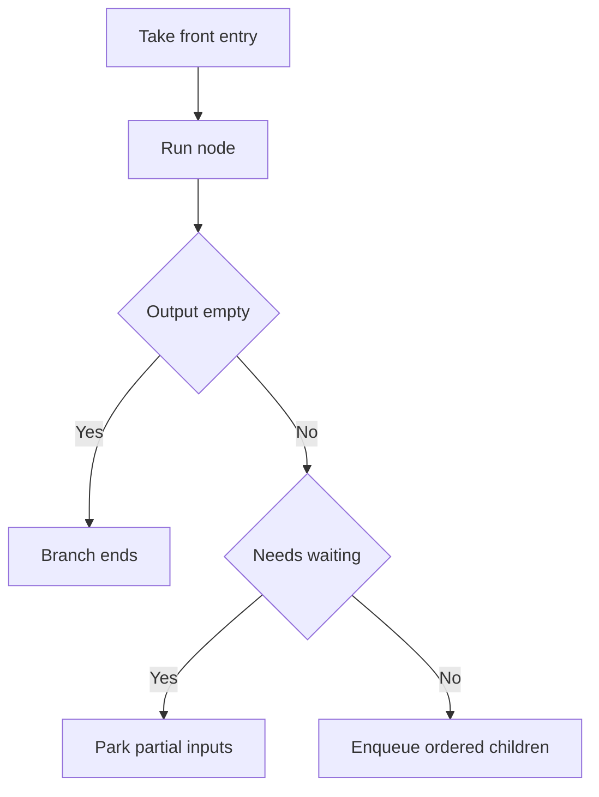

# How the engine decides what runs next

This page explains the live scheduler inside `WorkflowExecute`. It gives a new engineer enough of a model to predict execution order from the code without reading the whole engine first. The official summary lives at [Understand execution order](https://docs.n8n.io/build/flow-logic/understand-execution-order), and this page expands the machine underneath it.

For the broader trace of an execution, see [Anatomy of an execution](/01-anatomy-of-an-execution.md). When `processRunExecutionData` starts, the normal path has already seeded the stack in `WorkflowExecute.run`; partial executions rebuild that stack first, which is why [Partial executions and dirty nodes](/04-partial-executions-and-dirty-nodes.md) sits next to this page.

## The work list

`executionData.nodeExecutionStack` is the only work list the live loop needs. Each entry carries the node, the data that node should receive, and the source lineage that explains where the data came from. The loop always consumes from the front with `shift()`, so the execution order depends on where the scheduler adds new entries.

```ts
const enqueueFn = workflow.settings.executionOrder === 'v1' ? 'unshift' : 'push';
```

That single choice separates the two scheduling modes. `push` leaves new work at the tail, so older work runs first and the walk feels breadth-first. `unshift` puts new work at the front, so the current branch keeps running and the walk feels depth-first. The setting only changes scheduling. `executionOrder: 'v0' | 'v1'` names the node-ordering setting, and it does not match `IRunExecutionData.version` in `packages/workflow/src/run-execution-data/`.

## Sibling order follows the canvas, but only for siblings

When one node fans out to several children, v1 collects the children, sorts them by canvas position, and then enqueues them. The node closest to the top left runs first. That detail helps predict sibling order, but it does not turn the canvas into the execution graph; the canvas only shapes the order among ready siblings. See [The canvas is not the execution](/03-the-canvas-is-not-the-execution.md) for the difference between layout and runtime behavior.

## Joins wait until enough inputs arrive

A node with more than one input does not run as soon as one branch reaches it. `addNodeToBeExecuted` parks partial data in `waitingExecution` and `waitingExecutionSource` until the node has enough inputs to make sense of the run. The source map preserves lineage, which is why [Items, runs, and pairedItem](/05-items-runs-and-paireditem.md) matters when the downstream node needs to explain which item came from which parent.

The loop also gives waiting nodes a second chance after the main stack runs empty. That sweep pulls forward any node that now has enough input data, even if some other inputs stayed empty. That means a join can still complete after one branch dies early, while a node that still lacks required inputs stays parked. When a node expresses required inputs as a value, the scheduler resolves it before this sweep decides whether the node can run; see [Expressions and user code](/06-expressions-and-user-code.md).

## Empty output ends a branch unless the node chooses otherwise

If a node returns no data and does not enter waiting state, the branch ends there and the scheduler does not add downstream work. `alwaysOutputData` changes that outcome by fabricating a single empty item, which keeps the branch alive long enough for downstream nodes to run. Legacy `v0` keeps one more compatibility path: it can still wake certain downstream nodes on non-main inputs even when the upstream output is empty.

## Cycles rely on node state, not special graph logic

The scheduler does not treat a cycle as a separate execution mode. It keeps taking work from the front of the same list, and a node can only loop if it schedules more work for itself. `SplitInBatchesV3` shows the pattern: it stores loop state in `getContext('node')`, returns the next batch on the `loop` output, and finishes on `done`. The loop guard in `processRunExecutionData` stops accidental repeats when the same node and run index come back without progress. Queue mode keeps the same ordering rules after work moves between processes; see [One execution, many processes](/08-one-execution-many-processes.md).

## Retries and error routing stay inside the same scheduler

`retryOnFail` does not change how the engine chooses the next node. It only gives the current node more than one attempt, with a bounded try count and an optional pause between tries. If the node continues on fail, the engine keeps the branch alive and can pass through regular data or an error output. If the node does not continue on fail, the scheduler requeues the same execution entry on the work list and the branch stops from there.

## One loop iteration



## Where to look in the code

- `packages/core/src/execution-engine/workflow-execute.ts` — live scheduling, the work list, joins, retries, and the waiting-node sweep.
- `packages/core/src/execution-engine/partial-execution-utils/handle-cycles.ts` — cycle handling when a partial execution resumes.
- `packages/core/src/execution-engine/partial-execution-utils/recreate-node-execution-stack.ts` — stack reconstruction for resumed runs.
- `packages/nodes-base/nodes/SplitInBatches/v3/SplitInBatchesV3.node.ts` — a loop node example that stores state across runs.
- `packages/workflow/src/run-execution-data/run-execution-data.v0.ts` and `packages/workflow/src/run-execution-data/run-execution-data.v1.ts` — the run-data versions that stay separate from execution order.