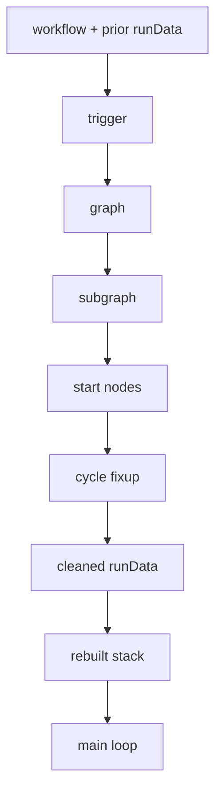

# Partial Executions and Dirty Nodes

Partial execution rebuilds state in front of the normal `WorkflowExecute` loop. It does not create a parallel executor; it narrows the graph, reconstructs the surviving state, and hands control back to the same loop that full runs use. That makes partial execution a reconstruction pass rather than a new runtime.

## When partial execution happens

The editor decides whether a run goes full or partial. `useRunWorkflow.ts` only forwards prior `runData` when `destinationNode !== undefined`, and it packages the `dirtyNodeNames` from the editor's `dirtinessByName` map, the chosen `destinationNode`, reusable `startNodes`, pin data, and any agent request context it needs. On the server, `manual-execution.service.ts` sends the request into `runPartialWorkflow2(...)` when `data.destinationNode` and `data.runData` point to a partial rerun. `consolidateRunDataAndStartNodes(...)` keeps reusable branches, returns `startNodeNames`, and trims `runData` so the rerun starts from the smallest safe boundary.

### `find-trigger-for-partial-execution.ts`

This step picks the trigger anchor in the code's preference order: the destination trigger comes first when it is enabled, then an enabled parent trigger with run data, then pinned triggers, and then webhook triggers ahead of any other parent trigger. That order keeps the rerun anchored to the closest valid trigger for the partial request.

### `directed-graph.ts` + `filter-disabled-nodes.ts`

Partial execution uses `directed-graph.ts` to turn the workflow into a mutable graph, then `filter-disabled-nodes.ts` removes disabled nodes and reconnects only `Main` paths. Full execution keeps the broader canvas model, so disabled nodes can still pass data through there; partial execution strips them because the rerun needs the live execution slice, not the broader canvas view. See also [03-the-canvas-is-not-the-execution](./03-the-canvas-is-not-the-execution.md).

### `find-subgraph.ts`

This step cuts the graph down to the branch from the trigger to the destination and then reattaches non-`Main` utility and AI edges that the branch still depends on. The result keeps the real execution slice, not just the visual path between two nodes, so the rerun still sees the support connections that the original execution relied on.

### `find-start-nodes.ts`

This step walks forward from trigger to destination and stops at the first dirty node on each branch. The live `isDirty(...)` rule marks a node dirty when it has an error or when it has no run data and no pinned data; pinned data wins and keeps the node clean. The editor can also mark nodes dirty through `dirtyNodeNames`, which gives the UI a direct way to force a rerun boundary. For the user-facing model of that behavior, see [Types of executions](https://docs.n8n.io/build/understand-workflows/understand-executions/types-of-executions) and [Understand dirty nodes](https://docs.n8n.io/build/understand-workflows/understand-executions/understand-dirty-nodes).

## Dirtiness answers the rerun question

Dirty state explains why a node runs again instead of reusing old output. The engine trusts pinned data first, because pin data represents an explicit fixture that should stay stable across partial reruns. If no pin exists and no prior run data survives, the node counts as dirty and the rerun starts there or upstream of there. That rule keeps reuse narrow and predictable, and it avoids mixing fresh work with stale downstream results.

## `handle-cycles.ts`

Cycles need special handling because a start node inside a loop can strand the rerun inside an unstable part of the graph. `handle-cycles.ts` uses strongly connected component analysis to move that start to the cycle entry, which gives the engine a clean boundary before it re-enters the loop.

## `clean-run-data.ts` + `recreate-node-execution-stack.ts`

After the graph settles, `clean-run-data.ts` removes old run data at and after the chosen starts and drops data outside the surviving subgraph. `recreate-node-execution-stack.ts` then rebuilds the execution stack and the waiting-input state from the run data that survived pruning and from pin data. From there the normal main loop resumes, and `WorkflowExecute` keeps deciding what runs next; the partial path simply hands it a rebuilt state instead of a cold start. For the surrounding execution model, see [01-anatomy-of-an-execution](./01-anatomy-of-an-execution.md) and [02-how-the-engine-decides-what-runs-next](./02-how-the-engine-decides-what-runs-next.md).

## Worked example

In a five-node chain, node 1 feeds node 2, node 2 feeds node 3, node 3 feeds node 4, and node 4 feeds node 5. If an engineer edits node 4 and then executes node 5, the editor marks node 4 dirty, preserves the clean results from nodes 1 through 3, and asks the server to rebuild state from the first dirty boundary before continuing to node 5. The rerun therefore repeats node 4 and the work downstream of it, while it keeps the earlier branch results that still match the current graph.

## Dated note

As of July 2026, this page describes the live partial-execution-v2 path. A few comments in `manual-execution.service.ts` still reference the removed v1 partial-execution implementation, but they are unrelated to the `executionOrder: 'v1'` node-ordering checks in `workflow-execute.ts`; `runPartialWorkflow2(...)` now carries the live behavior.

As of July 2026, tool and AI sub-node partial execution follows a special path through `rewire-graph.ts`, which inserts the virtual `tool-executor` node before the normal rerun resumes.

## Pipeline

## Where to look in the code

- `packages/frontend/editor-ui/src/app/composables/useRunWorkflow.ts` — packages the partial request, including prior `runData`, dirty names, `startNodes`, and `destinationNode`.
- `packages/cli/src/manual-execution.service.ts` — routes manual runs into `runPartialWorkflow2(...)` when the request carries reusable state.
- `packages/core/src/execution-engine/workflow-execute.ts` — owns the live partial-execution-v2 pipeline and its step order.
- `packages/core/src/execution-engine/partial-execution-utils/find-start-nodes.ts` — defines the current dirtiness rule and the first dirty boundary.
- `packages/core/src/execution-engine/partial-execution-utils/clean-run-data.ts` and `packages/core/src/execution-engine/partial-execution-utils/recreate-node-execution-stack.ts` — remove stale run data and rebuild the surviving stack before the main loop resumes.
- `packages/core/src/execution-engine/partial-execution-utils/rewire-graph.ts` — handles the special tool and AI sub-node path.
