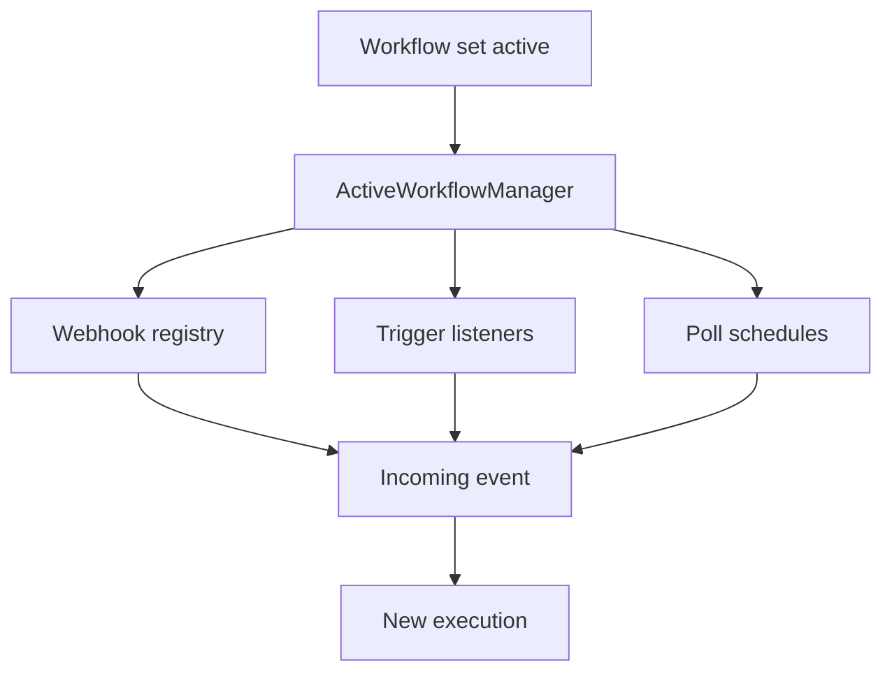

# Triggers, Webhooks, and Activation

Workflow activation ties the editor's start signals to the runtime that turns them into executions. It covers the three start paths in this codebase: active triggers, pollers, and webhooks, and it shows why the editor uses a different path from production.

Related pages:

- [The big picture](./00-the-big-picture.md)
- [Anatomy of an execution](./01-anatomy-of-an-execution.md)
- [The canvas is not the execution](./03-the-canvas-is-not-the-execution.md)
- [Partial executions and dirty nodes](./04-partial-executions-and-dirty-nodes.md)
- [One execution, many processes](./08-one-execution-many-processes.md)

Official docs:

- [Wait node usage page](https://docs.n8n.io/build/flow-logic/wait)
- [manual-vs-production executions page](https://docs.n8n.io/build/understand-workflows/understand-executions/types-of-executions)
- [queue mode hosting guide](https://docs.n8n.io/deploy/host-n8n/configure-n8n/scaling/enable-queue-mode)

## The three start mechanics

Active triggers keep a listener open. `TriggersAndPollers.runTriggerFunction()` starts each trigger implementation, and `ActiveWorkflowTriggers` keeps the returned trigger response in memory on the leader. In manual runs, `runTriggerFunction()` adds a one-shot `manualTriggerResponse` so the editor can wait for the first emitted item.

Pollers wake up on a schedule. `TriggersAndPollers.runPollFunction()` calls `poll()`, `PollTriggerExecutor` wraps the call in its own trace, and `ScheduledTaskManager` fires the registered cron only on the leader. `PollTriggerExecutor` also drops results from a superseded registration, so a late poll never starts the old version of a workflow.

Webhooks wait for HTTP requests. `WebhookService` derives webhook definitions from node metadata, normalizes their paths, stores them by method and path, and lets the request handler look them up when a request arrives. `webhook-request-handler.ts` then turns the request into a webhook response and passes the result into the engine.

## What activation changes

Flipping a workflow active does not run the whole graph. `ActiveWorkflowManager` loads active workflows when the process starts and again when leadership changes, then registers the matching start mechanics for each active version. Webhook rows go into storage, while trigger listeners and poll schedules live in memory on the leader only.

The manager treats activation as an all-or-nothing step. If one start mechanic fails after another one already came up, it tears down the partial state, removes the active version, and records the failure. When the error looks transient, it queues another activation attempt; when the error points to authorization, it stops retrying.

In queue or multi-main mode, the leader owns the in-memory listeners and cron schedules. Other instances still keep the stored webhook rows, so request handling can continue through the shared webhook lookup and execution path.

## Manual runs and production runs

The editor uses temporary registrations for test runs. `TestWebhooks` creates a short-lived test webhook, registers it with `WebhookService.createWebhookIfNotExists(..., 'manual', 'manual')`, and removes it after the first hit or when the timeout expires. The cancel endpoint tears down the same temporary state if the editor closes the test session early.

Manual execution also changes how the runtime treats the trigger node. `WorkflowExecute.executeTriggerNode()` runs `trigger()` in `mode: 'manual'`, waits for the single-use `manualTriggerResponse`, and returns the first emitted items to the run loop. `WorkflowExecute.executePollNode()` follows the same split: manual mode runs the poll function directly, while non-manual modes reuse the data that activation already collected.

Production activation takes the opposite path. The runtime stores persistent webhook rows, registers live listeners only on the leader, and runs the workflow in `mode: 'trigger'` or `mode: 'webhook'` when a real event arrives. When the editor has no live event to listen for, pinned data fills the initial run data so the canvas can still continue the flow.

## Webhook lifecycle

Webhook definitions start in node metadata. `WebhookService.getNodeWebhooks()` evaluates each node's path and method, normalizes the result, and creates the durable row that identifies the webhook. `WebhooksController.findWebhook()` looks up that row by method and path, and the request handler uses the result to dispatch the incoming request.

`WebhookService.runWebhook()` builds a `WebhookContext`, calls the node's webhook implementation, and then closes any resources the node opened. The request handler accepts the modern `WebhookResponse` shapes for static data, streams, or no response, and it still supports the older raw response shape for existing paths.

`waiting-webhooks.ts` handles a separate resume-by-callback path for the Wait node. That path does not start a fresh workflow. It resumes a paused execution after the callback URL validates the stored token or signature.

## From first item to execution

After the start mechanic fires, the payload becomes the first item in the execution stack. `WorkflowExecute.run()` seeds `nodeExecutionStack` from the selected start node and `triggerToStartFrom.data`, then `runNode()` chooses the trigger, poll, webhook, or normal branch. `TriggerExecutionContextFactory` saves static data before it hands the payload to the workflow runner, and it emits `workflow-executed` after the run receives an execution ID.

This handoff matters because the activation layer never executes business logic itself. It only decides which start source owns the first payload and which runtime path turns that payload into the initial execution stack. From there, [Anatomy of an execution](./01-anatomy-of-an-execution.md) takes over.

## Where to look in the code

- `packages/cli/src/active-workflow-manager.ts` — coordinates startup, teardown, retries, and leader handoff.
- `packages/core/src/execution-engine/active-workflow-triggers.ts` — tracks in-memory non-webhook triggers and leader-local cron state.
- `packages/core/src/execution-engine/triggers-and-pollers.ts` — runs trigger and poll implementations and bridges manual mode.
- `packages/core/src/execution-engine/workflow-execute.ts` — seeds the initial stack and routes trigger, poll, and webhook nodes.
- `packages/cli/src/webhooks/webhook.service.ts` — stores, finds, normalizes, and runs webhooks.
- `packages/cli/src/webhooks/test-webhooks.ts` — manages the editor's temporary test-webhook lifecycle.
- `packages/cli/src/webhooks/waiting-webhooks.ts` — resumes Wait node executions from callback URLs.