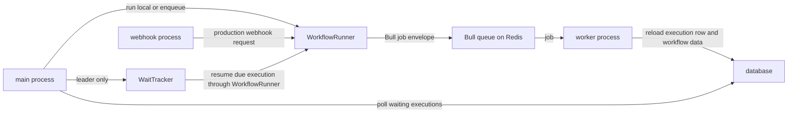

# One Execution, Many Processes

One n8n execution stays coherent because the engine keeps its run state in one serializable `IRunExecutionData` object, created with `createRunExecutionData`. Queueing, waiting, resuming, sub-workflow dispatch, and error workflows all move that object across storage boundaries, load it again, and rebuild the same loop around it.

See [Anatomy of an execution](/01-anatomy-of-an-execution.md) and [Items, runs, and `pairedItem`](/05-items-runs-and-paireditem.md) for the shape of that state. For the broader execution-mode matrix, see the official [execution types](https://docs.n8n.io/workflows/executions/execution-types/) page.

## The run object decides where execution lives

`WorkflowRunner` acts as the switchboard in `packages/cli/src/workflow-runner.ts`. It chooses between in-process execution and queue mode based on the configured execution mode and the kind of run it receives. In queue mode, it sends a small execution envelope to Bull over Redis, not to BullMQ.

The queue job carries only the information needed to find the real execution record again: execution ID, workflow ID, and a small set of execution flags. `packages/cli/src/scaling/job-processor.ts` then reloads the execution row from the database, refreshes workflow static data when the job asks for it, rebuilds the workflow object, and runs the engine from that stored state. The worker talks back through Bull progress messages, and the main or webhook process uses those messages for completion, streamed chunks, and webhook responses.

For deployment and sizing guidance, use the official [queue-mode hosting guide](https://docs.n8n.io/hosting/scaling/queue-mode/). That guide covers operational choices; this page only describes the runtime shape.

## The process roles

`packages/cli/src/commands/start.ts` brings up the main process. It starts the API and editor, loads active workflows, starts scheduling, pruning, workflow history, and the wait tracker, and then hands leader-gated duties to multi-main when that mode is enabled. In queue mode, the main process also owns the shared orchestration paths that support workers and webhook listeners.

`packages/cli/src/commands/worker.ts` starts the worker process. It sets a concurrency cap for how many Bull jobs the worker consumes at once, then runs the job processor. That cap solves a different problem from regular-mode concurrency control: it limits queue consumption, not in-process execution.

`packages/cli/src/commands/webhook.ts` starts the webhook process. In queue mode it intercepts production webhook traffic, initializes the webhook server, and hands incoming work into the same execution pipeline that `WorkflowRunner` uses everywhere else.

`packages/cli/src/scaling/multi-main-setup.ee.ts` adds a leader-election layer for multi-main deployments. As of this code, the module lives in an enterprise-licensed file. It keeps singleton duties on the leader, steps followers down when leadership changes, and lets followers take over later without changing the execution model.

## Waiting keeps the same execution alive

The Wait node does not start a fresh run. `packages/core/src/execution-engine/workflow-execute.ts` stores the pause in the same run object, sets `waitTill`, records the task as waiting, and exits the active loop. When the execution resumes, `handleWaitingState()` clears `waitTill`, disables the current stack entry unless that entry carries `resumeError`, and removes the last run entry for the paused node so the resumed task does not appear twice.

`packages/cli/src/wait-tracker.ts` drives that resume loop. The leader main process polls the database for due waiting executions, sets timers for each due record, and calls `WorkflowRunner` when a timer fires. In queue mode, that resumed execution can still move onto a worker, which keeps the waiting path aligned with every other queued path.

The additional data object also exposes `webhookWaitingBaseUrl`, the waiting-webhook surface used by pause-and-resume flows. For the webhook-facing part of that surface, see [Triggers, webhooks, and activation](/07-triggers-webhooks-and-activation.md). For node-level usage details, see the official [Wait node docs](https://docs.n8n.io/integrations/builtin/core-nodes/n8n-nodes-base.wait/).

## Sub-workflows create child executions

`packages/cli/src/workflow-execute-additional-data.ts::executeWorkflow` starts a child execution with its own execution record, its own run data, and its own lifecycle hooks. `parentExecution` metadata links the two sides, but the child still behaves like a separate execution boundary. The caller can continue immediately through `doNotWaitToFinish`, or it can wait for the child result and continue only after that result returns.

The helper loads draft workflow data for manual and chat runs, and published workflow data for production runs. That split lets an engineer iterate on a child workflow during interactive work without publishing it first, while production still uses the active version. Item lineage narrows at the boundary: the parent receives the returned output items, not the child’s full internal `pairedItem` history. See [Items, runs, and `pairedItem`](/05-items-runs-and-paireditem.md) for that limitation.

## Error workflows spawn a separate run

`packages/cli/src/workflows/workflow-execution.service.ts::executeErrorWorkflow` does not resume the failed parent. It loads the active or published version of the error workflow, checks the sub-workflow policy, and then starts a brand-new error-workflow execution with a single error item whose JSON body contains `workflowErrorData`.

The failed parent sets `shouldResume` to `false`, so the error workflow stays separate from the original workflow run. That boundary matters for item lineage as well: the error workflow gets a fresh execution story, not a normal branch continuation.

## Two concurrency controls

Queue workers and regular-mode concurrency control solve different problems. Worker concurrency in `packages/cli/src/commands/worker.ts` limits how many Bull jobs a worker consumes in parallel. Regular-mode concurrency control in `packages/cli/src/concurrency/concurrency-control.service.ts`, `packages/cli/src/concurrency/concurrency-queue.ts`, and `packages/cli/src/concurrency/concurrency-capacity-reservation.ts` throttles production and evaluation executions inside the process. The first protects worker throughput; the second protects an in-process deployment from taking on too much at once.

## Who does what

| Path | Regular mode | Queue mode |
| --- | --- | --- |
| Manual run | The main process runs the execution in process. | The main process keeps the run local by default; when manual offload is enabled, `WorkflowRunner` hands it to a worker. |
| Production webhook | The main process receives the webhook and runs the execution in process. | The webhook process receives the request, `WorkflowRunner` enqueues the job, and a worker runs it. |
| Cron poll | The main process schedules and runs the execution in process. | The main process schedules the run, then `WorkflowRunner` can hand it to a worker. |
| Wait due | The leader main process resumes the paused run in process. | The leader main process resumes through `WorkflowRunner`, which can hand the continuation to a worker. |
| Sub-workflow call | The parent process starts the child execution and can wait for it or continue immediately. | The child execution stays in the worker path with its parent, instead of becoming a separate queue hop. |

## Where to look in the code

- `packages/core/src/execution-engine/workflow-execute.ts` — run loop, waiting state, resume behavior, and node re-entry.
- `packages/cli/src/workflow-runner.ts` — in-process versus queued dispatch.
- `packages/cli/src/scaling/scaling.service.ts` and `packages/cli/src/scaling/job-processor.ts` — Bull queue setup, progress messages, and worker reload path.
- `packages/cli/src/commands/start.ts`, `packages/cli/src/commands/worker.ts`, and `packages/cli/src/commands/webhook.ts` — process roles.
- `packages/cli/src/wait-tracker.ts` and `packages/cli/src/scaling/multi-main-setup.ee.ts` — wait resumption and leader-gated singleton duties.
- `packages/cli/src/workflow-execute-additional-data.ts` and `packages/cli/src/workflows/workflow-execution.service.ts` — sub-workflows and error workflows.